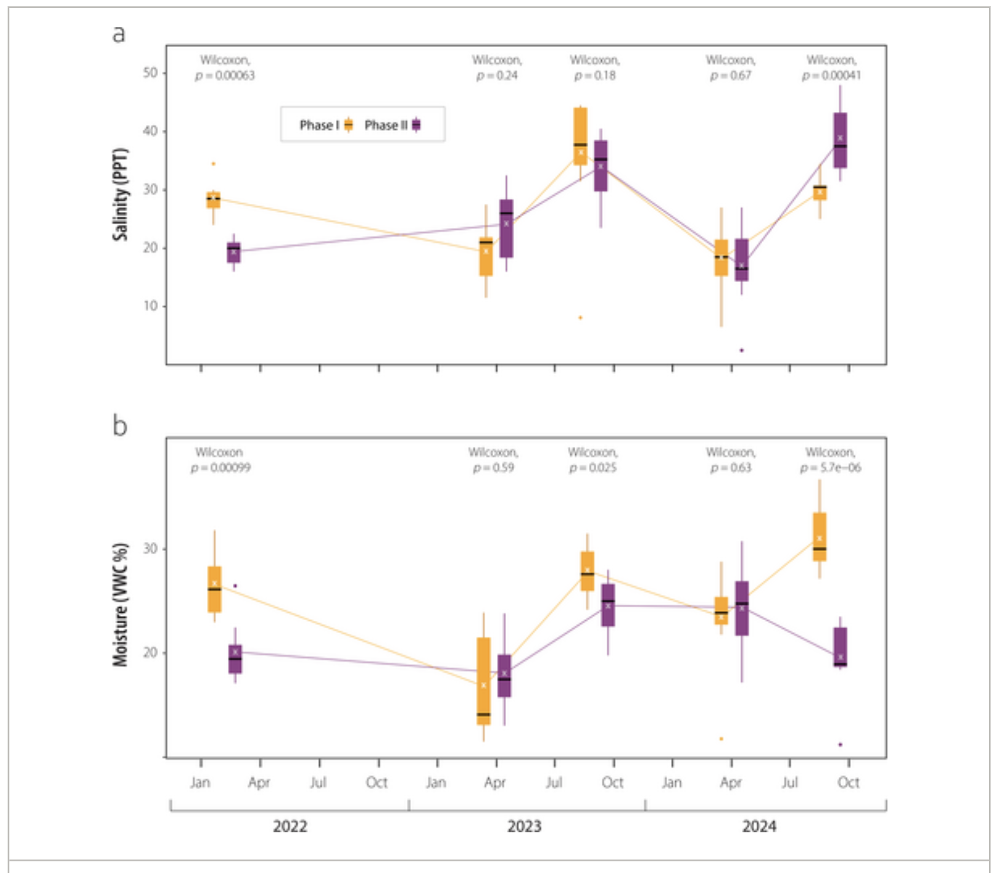

Questions for Prof Bui:
- Is it okay to run t-tests and linear models for my figures? its ok
- Is it okay to have more than two figures for my data? 
- How do I cite my own data? don't need to. Maybe last updated
- is it okay to have axis lines for my personal data figures? axis lines diff from grid lines, okay to keep axis lines
- anything to reduce file size of photos reduces rendered 

# Part 1. Set up tasks

Load in libraries 
```{r}
#| message: false
#| warning: false

# loading in libraries for this homework
library(tidyverse)
library(here)
library(janitor)
library(readxl)
library(ggplot2)
library(ggeffects)
library(flextable)

```


```{r}
# store temp-kelp.csv as an object called kelp
kelp <- read_csv(here("data", "temp-kelp.csv"))

# store my personal data 
my_data <- read_csv(here("data/screen_time.csv"))

```


# Part 2. Problems
## Problem 1. Giant kelp fronds
a. An appropriate test\newline
The two appropriate tests to determine the strength of the relationship between temperature and giant kelp frond elongation rate are Pearson's correlation and Spearman rank correlation; both of which assume that observations are independent. A Pearson's correlation test is performed for a parametric sample where it is assumed that the variables are continuous, normally distributed, and that there is a linear relationship between them. A Spearman rank correlation test is performed for a non-parametric sample where it is assumed that there is a monotonic relationship between the variables. 


b. Create a visualization\newline

```{r}

# ggplot as base layer 
ggplot(
  # data is kelp
  # temp is x-axis
  # kelp_elongation is y-axis
  data = kelp,
  mapping = aes(x = temp_c,
                y = kelp_elong
                )
) + 
  # geom_point as first layer
  geom_point(
    # changing color of points
    color = 'springgreen4' 
  ) +
  # relabelling x and y axis
  labs(
    x = "Temperatures (Celcius)",
    y = "Kelp Elongation Rate (cm/day)"
  ) +
  # changing the theme from the default
  theme_minimal()

```

c. Check your assumptions and run your test\newline

### Checking assumptions
```{r}

# ggplot as base layer
ggplot(
  # using kelp data
  data = kelp,
  # plotting temperature 
  mapping = aes(sample = temp_c)
) +
  # qq line is first layer
  geom_qq_line() +
  # qq points are second layer
  # changing color of the points
  geom_qq(color = 'tomato4') +
  # setting theme as minimal
  theme_minimal()


# ggplot as base layer 
ggplot(
  # using kelp data
  data = kelp,
  # plotting kelp elongation rate
  mapping = aes(sample = kelp_elong)
) +
  # qq line is first layer
  geom_qq_line() +
  # qq points are second layer
  # changing color of points
  geom_qq(color = 'skyblue3') +
  # setting theme as minimal
  theme_minimal()


```

I checked the assumption that there is a linear relationship between the two variables by looking at the scatterplot of temperature and kelp elongation rate and determined that there is a linear relationship between them. I checked the assumption that the two variables are normally distributed by looking at a qq plot for each of the variables. Since the points are generally around the qq line and are randomly scattered above and below, I determined that there is a normal distribution for both variables. 


### Running Pearson's Correlation Test
```{r}

# running a correlation test
cor.test(
         # testing correlation between kelp elongation rate and temperature 
         kelp$kelp_elong, kelp$temp_c,
         # method tells you what type of pearson's correlatoin
         method = "pearson")

```

d. Results communication\newline
To evaluate the strength of the relationship between temperature and giant kelp frond elongation rate, I used a Pearson's correlation test. We found a moderate negative relationship between temperature and kelp frond elongation rate (Pearson's correlation, r = -0.6877489, t(30) = -5.189, p = 1.366e-05, $\alpha$ = 0.05).

e. Test implications\newline
I found that as temperature increases, the kelp elongation rate decreases. This is based on my Pearson's correlation test, where I found a moderate negative relationship between temperatures and kelp frond elongation rate (Pearson's correlation, r = -0.6877489, t(30) = -5.189, p = 1.366e-05, $\alpha$ = 0.05). Based on these results we can infer that kelp growth rates will be lowered during warmer weather and can be permanently decreased due to climate change. 

f. Double check your own work\newline

```{r}
#| warning: false

# running spearmans correlation test 
cor.test(
  # testing correlation between temperature and kelp elongation rate
  kelp$temp_c, kelp$kelp_elong,
  # doing a spearman's correlation
  method = "spearman"
)

```

Both the Pearson's correlation test and Spearman's correlation test would have led me to make the same decision. The Spearman's correlation test also found a moderate negative relationship between temperature and kelp frond elongation rates (Spearman's correlation, $\rho$ =  -0.6891684, S = 9216.1, p = 1.29e-05, $\alpha$ = 0.05)

## Problem 2. Personal data

a. Updating your visualizations\newline

Cleaning my_data
```{r}

# cleaning my_data and storing it as object my_data_clean
my_data_clean <- my_data |>
  # dropping rows that contain NA values in the computer_time column
  drop_na(computer_time) |>
  # changing weekday variable inputs
  mutate(weekday = case_when(
    # y inputs in the weekday column are now displayed as Weekdays
    # n inputs in the weekday column are not displayed as Weekends
    weekday == "y" ~ "Weekdays",
    weekday == "n" ~ "Weekends"
  ))

my_data_clean <- my_data_clean |>
  mutate(total_screen_time = computer_time + phone_time)

```


```{r}

# base layer is ggplot
# data is my_data_clean
ggplot(data = my_data_clean,
       # x axis is whether it is a weekday or weekend
       # y axis is the computer screen time
       # color is based on whether it is the weekday or weekend group
       mapping = aes(x = weekday,
                     y = computer_time,
                     color = weekday)) +
  # boxplot is second layer
  geom_boxplot() +
  # jitter plot is the third layer
  geom_jitter(shape = 21) +
  # renaming y axis, x axis, and title
  labs(y = "Computer Screen Time (minutes)",
       x = "",
       title = "Weekdays Have Greater Computer Screen Time on Average",
       subtitle = "05-27-2026") +
  # manually setting color for Weekdays and Weekends gropus
  scale_color_manual(values = c("Weekdays" = "dodgerblue3",
                                "Weekends" = 'orange2')) +
  # changing the theme from the default
  theme_classic() +
  # removing legend 
  theme(legend.position = "none")

```
**Figure 1. Weekdays Have Greater Computer Screen Time on Average**. Hollow blue points represent Weekday daily computer screen times from April 20, 2026 to May 27, 2026. Hollow orange points Weekend daily computer screen times from April 20, 2026 to May 27, 2026. The bottom line of the box represents the 25th percentile, the middle line represents the median, and the top line represents the 75th percentile. The lines extended out from the boxplot extend to the furthest point within 1.5 times the value of the IQR. The filled in point in the Weekdays group represents an outlier further than 1.5 times the IQR above the 75th percentile. Data originally from: Jared Umphress. 2026. Computer Screen Time Data. Data accessed 2026-05-28.

```{r}

# ggplot is base layer
ggplot(data = my_data_clean,
       # x axis is time spent on non computer activities
       # y axis is computer screen time
       # the color of the plot will be orchid4
       mapping = aes(x = time_activities,
                     y = computer_time
                     )) +
  # points are second layer
  geom_point(color = "orchid4") +
  # renaming x axis, y axis, and title
  labs(x = "Non-Computer Activity Time (minutes)",
       y = "Computer Screen Time (minutes",
       title = "Activity Time effect on Computer Screen Time is Unclear",
       subtitle = "05-27-2026") +
  # changing theme from the default
  theme_classic() +
  # removing legend
  theme(legend.position = "none")


 #theme(legend.position = "none",
 #       panel.grid.major = element_blank(),
 #        panel.grid.minor = element_blank(),
 #        panel.background = element_blank(),
 #        plot.background = element_blank()

```
**Figure 3. Computer Screen Time in Relation to Non-Computer Activity Time.** The filled in purple points represent a given days Non-Computer Activity Time and Computer Screen Time. Data originally from: Jared Umphress. 2026. Computer Screen Time Data. Data accessed 2026-05-28.

b. Captions\newline
Captions included above. 

## Problem 3. Affective visualization

a. Describe in words what an affective visualization could look like for your personal data.\newline

Since I am comparing computer screen time between weekdays vs weekends, I want to create a dichotomous visual. The weekdays and weekend group will each have images that combine to form sort of a boxplot. I would like to frame more computer screen time as bad and less screen time as good. Since weekdays had higher average computer screen times I want to use negative meme photos. Since weekends had lower average computer screen times I want to use positive meme photos. 

b. Create a sketch (on paper) of your idea\newline
{width=100% fig-align="center"}

c. Make a draft of your visualization\newline
{width=100% fig-align="center"}

d. Write an artist statement\newline
I am showing the differences in computer screen time between weekdays and weekends. The inspiration for the watercolor background was Jill Pelto's paintings. The inspiratoin for the imagery were popular memes and feeling provoking images that I have found online or have captured of my own life. I developed my piece on canva and added imagery that felt either negative or positive, letting my creativity roam freely throughout the process. 
e. Prep your materials to share in class\newline

[Affective Visual Presentation](https://docs.google.com/presentation/d/1Y7-z5dcnbAaKNBAqVxenq7AqtHwft9xEEiFj2JxDOcY/edit?usp=sharing)

## Problem 4. Statistical critique

a. Revisit and summarize\newline

----------
I have selected one of the Wilcoxon's test.

The response variables are soil salinity and water content. The predictor variable is one of the two Phase sites. 


The Wilcoxon test addresses the authors main question about the difference of soil abiotic factors between the two Phase sites. 

A significant result would indicate that there is a difference in soil conditions between the two phase sites and thus they can use the two sites to compare how soil salinity and soil moisture affect plant establishment success.\newline
-------

What are the statistical tests the authors are using to address their main research question?

The authors used a Wilcoxon test to determine whether there is a difference in soil salinity and water content between two phase sites. A significant result would indicate that there is a difference in soil conditions between the two phase sites and thus they can use the two sites to compare how soil salinity and soil moisture affect plant establishment success. Comparing the two sites helps address the authors main question of how successful plant establishment is after the soil topography has been moved based on different abiotic factors. 


b. Visual clarity\newline

The x-axis is time and the y-axis is salinity for one of the figure and moisture for the other figures which makes sense. They show the medians, 25th percentile, 75th percentile, and outliers through boxplots. The wilcoxon test results is displayed above each month that had measurements for the two phase sites. Overall, the visual clarity is strong, with the main statistical results displayed in a clear manner. 

c. Aesthetic clarity\newline

